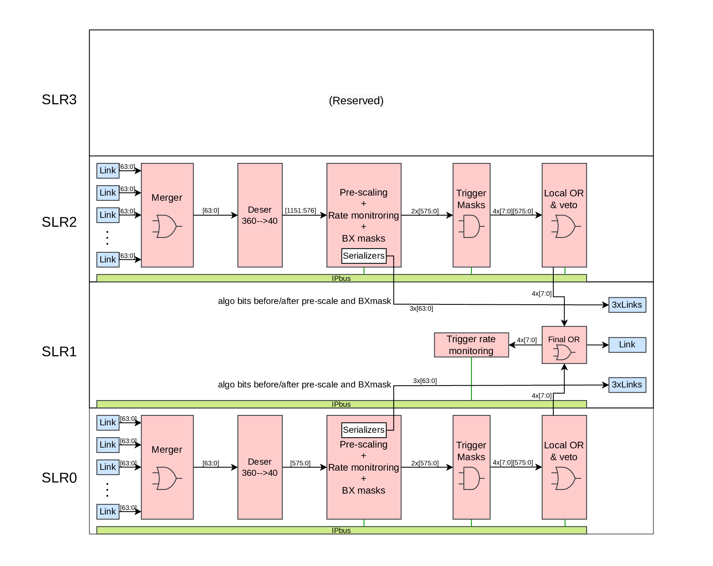

# FinalOR GT VHDL files

# Overview

<center>
    
</center>

| Link | Quad | Direction | Description | Target |
| ---      | ---      | --- | --- | --- | 
| 0-11 | 0-2 | IN | Links 0-11 low algos| Algo boards 0-11 |
| 116-127 | 29-31 | IN | Links 12-23 low algos| Algo boards 0-11 |
| 36-47 | 9-11 | IN | Links 0-11 high algos| Algo boards 0-11 |
| 80-91 |20-22 | IN | Links 12-23 high algos| Algo boards 0-11 |
| 24-26 |6 | OUT | Low algobits| DAQ, Scouting |
| 27-29 |6-7 | OUT | High algos bits| DAQ, Scouting |
| 96 |24 | OUT | Finor out bits| TCDS-2 | 

# Output FinOR bits

| Bits | Name | With veto? | 
| ---      | ---      | --- |
| 0-7    | FinOR trigger bits| No| 
| 8-15   | FinOR preview trigger bits| No | 
| 23-16  | FinOR trigger bits| Yes | 
| 31-24  | FinOR preview trigger bits| Yes | 
| 575-32 | Reserved| X | 

# Available rate counters

| Register | IPBus name | Width | 
| ---      | ---      | --- |
| Algo rate counters unprescaled    | cnt_rate_before_prsc | 1152|
| Algo rate counters prescaled    | cnt_rate_after_prsc | 1152|
| Algo rate counters prescaled (preview)    | cnt_rate_after_prsc_prvw | 1152|
| Algo rate counters prescaled post dead-time    | cnt_rate_pdt | 1152|
| SLRs Veto rate counter    | Veto_cnt | 2|
| FinOR rate counter    | cnt_rate_finor | 8|
| FinOR rate counter post dead-time    | cnt_rate_finor_pdt | 8|
| FinOR rate counter (preview)    | cnt_rate_finor_preview | 8|
| FinOR rate counter post dead-time (preview)    | cnt_rate_finor_preview_pdt | 8|
| FinOR rate counter (vetoed)    | cnt_rate_finor_with_veto | 8|
| FinOR rate counter post dead-time (vetoed)    | cnt_rate_finor_with_veto_pdt | 8|
| FinOR rate counter (vetoed, preview)    | cnt_rate_finor_preview_with_veto | 8|
| FinOR rate counter post dead-time (vetoed, preview)    | cnt_rate_finor_preview_with_veto_pdt | 8|
| GlobalVeto rate counter    | Veto_cnt | 1|

# Supported boards

| Board | FPGA | Depfile name | 
| ---      | ---      | ---      |
| Serenity | VU13P-2-e-flga2577 | `top_serenity_vu13p-so2.d3` |

# Requirements

* Vivado 2020.1 or later
* ipbb 2021j or later
* uHAL[^1]
* Access to the TCDS2 Gitlab repository. (Can be requested at https://cmstcds2.docs.cern.ch/.)
* Access to the EMP repository.

[^1]: https://ipbus.web.cern.ch/doc/user/html/software/installation.html

# Setup instructions

### Get all the required packages
```bash
# If you don't have ipbb installed yet
curl -L https://github.com/ipbus/ipbb/archive/dev/2021j.tar.gz | tar xvz
source ipbb-dev-2021j/env.sh

ipbb init gt-finor-work
cd gt-finor-work
ipbb add git https://:@gitlab.cern.ch:8443/p2-xware/firmware/emp-fwk.git -b v0.7.6
ipbb add git https://github.com/ipbus/ipbus-firmware -b v1.9
ipbb add git https://:@gitlab.cern.ch:8443/cms-tcds/cms-tcds2-firmware.git -b v0_1_1
ipbb add git https://gitlab.cern.ch/HPTD/tclink.git -r fda0bcf
ipbb add git https://gitlab.cern.ch/ttc/legacy_ttc.git -b v2.1
ipbb add git https://:@gitlab.cern.ch:8443/cms-cactus/phase2/firmware/gt-final-or.git
ipbb add git https://gitlab.cern.ch/dth_p1-v2/slinkrocket_ips.git -b v03.09
ipbb add git https://:@gitlab.cern.ch:8443/dth_p1-v2/slinkrocket.git -b v03.10
```

# Build instructions
### Create firmware project
```bash
ipbb proj create vivado gt-final-or gt-final-or:finor-hdl top_serenity_vu13p-so2.d3
cd proj/gt-final-or

# Make uhal tools available
export PATH=/opt/cactus/bin/uhal/tools:$PATH
export LD_LIBRARY_PATH=/opt/cactus/lib:$LD_LIBRARY_PATH

ipbb ipbus gendecoders -f
ipbb vivado generate-project
```

And build it with:

```bash
ipbb vivado synth -j4 impl -j4
ipbb vivado bitfile package
```

# Simulation instructions
Get required packages as in the previous section.

### Generate the pattern files used in the simulation(s)
The input pattern file is generated by a custom python script, it can be found ```scripts/PatternProducer.py```.  
Run the script 
```bash
cd src/gt-final-or/scripts
python PatternProducer.py -i 1152 -s Serenity3
cd ../../..
```

### Create the simulation project (work in progress)
```bash
ipbb proj create sim finor_sim gt-final-or:simulation top_serenity_vu13p-so2.d3
cd proj/finor_sim
ipbb sim setup-simlib
ipbb sim ipcores
ipbb sim fli-udp
ipbb sim addrtab
ipbb sim generate-project
touch design.txt
```

Copy the generated pattern files and scripts in the project directory.
```bash
cp -r ../../src/gt-final-or/scripts .
cp -r addrtab scripts/
cd scripts
echo '<connections>' > my_connections.xml
echo '  <connection id="'x0'" uri="ipbusudp-2.0://localhost:50001" address_table="file://addrtab/sim.xml" />' >> my_connections.xml
echo '</connections>' >> my_connections.xml
cat my_connections.xml
cd ..
```

### Launch the simulation with Questasim
Run one of the commands to enter the command line interface depending on the target test
```bash
vsim -c work.top work.glbl -Gsourcefile=scripts/Pattern_files/Finor_input_pattern_prescaler_test.txt -Gsinkfile=out_prescaler_test.txt
vsim -c work.top work.glbl -Gsourcefile=scripts/Pattern_files/Finor_input_pattern_trigg_test.txt -Gsinkfile=out_trigg_test.txt
vsim -c work.top work.glbl -Gsourcefile=scripts/Pattern_files/Finor_input_pattern_veto_test.txt -Gsinkfile=out_veto_test.txt
vsim -c work.top work.glbl -Gsourcefile=scripts/Pattern_files/Finor_input_pattern_BXmask_test.txt -Gsinkfile=out_BXmask_test.txt
```
To start the simulation use the command
```
run -all
```

To run the simulation in the GUI use the following commands instead
```bash
vsim work.top work.glbl -Gsourcefile=scripts/Pattern_files/Finor_input_pattern_prescaler_test.txt -Gsinkfile=out_prescaler_test.txt
vsim work.top work.glbl -Gsourcefile=scripts/Pattern_files/Finor_input_pattern_trigg_test.txt -Gsinkfile=out_trigg_test.txt
vsim work.top work.glbl -Gsourcefile=scripts/Pattern_files/Finor_input_pattern_veto_test.txt -Gsinkfile=out_veto_test.txt
vsim work.top work.glbl -Gsourcefile=scripts/Pattern_files/Finor_input_pattern_BXmask_test.txt -Gsinkfile=out_BXmask_test.txt
```

If you want to simulate the GT-algo board latency add the following argument at the end of the simulation command (change the value if needed)
```
-Gplayoffset=131
```

### Interact with the simulation with IPbus

Open a new shell in the project folder and go to the `scripts` directory
```bash
cd scripts
```
Launch one of the test available with the command
```bash
python RateChecker.py -t prescaler -p random -ls 3 -c my_connections.xml -S
python RateChecker.py -t trigger_mask -p random -ls 3 -c my_connections.xml -S
python RateChecker.py -t veto_mask -p random -ls 3 -c my_connections.xml -S
python RateChecker.py -t BXmask -p random -ls 3 -c my_connections.xml -S
```
Check output unprescaled algobits, this requires that the prescale test is run beforehand.
```
python RateChecker.py -t algo-out
```
